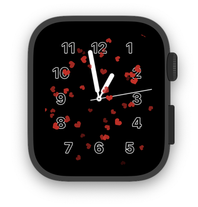
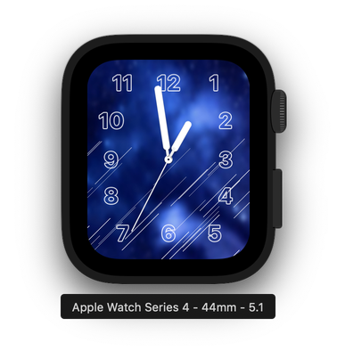
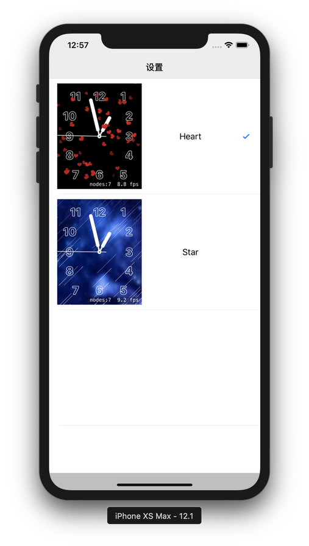
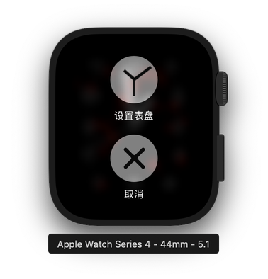

# WatchOSFace

* [中文版](./README_CN.md)

An Apple Watch face application with SpriteKit on WatchOS. 

Written with .

## Update Log

* 2019.2.22 Fixed the BAD ADRESS bug.

* 2019.2.23 Add macOS support.

Because of the Chinese College entrance examination, I have to pause the progress of the project.

# License
Copyright © 2019 Jack Lee. All rights reserved.

Licensed under the GPL-2.0 License.

# Dependencies
* [ProgressHUD](https://github.com/relatedcode/ProgressHUD)
* How to hide digital time : [SpriteKitWatchFace](https://github.com/steventroughtonsmith/SpriteKitWatchFace)

# Screenshots in Application

